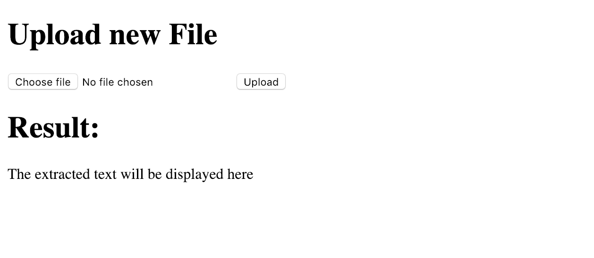
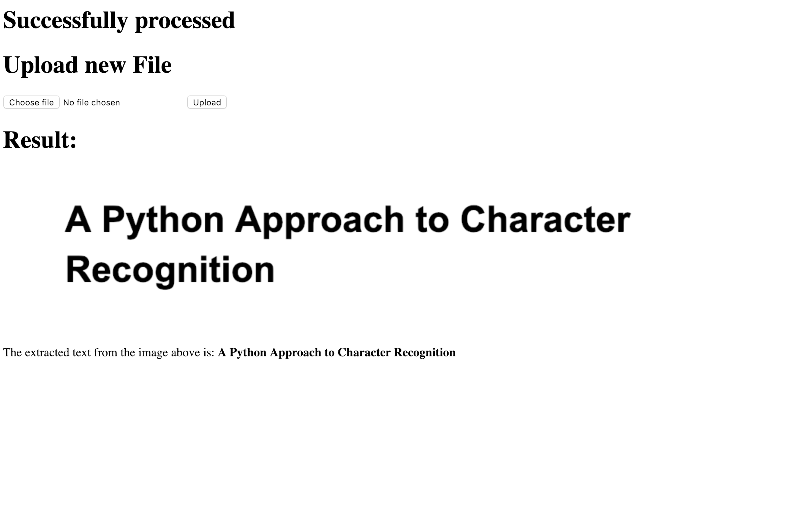
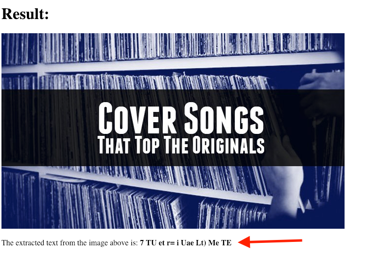
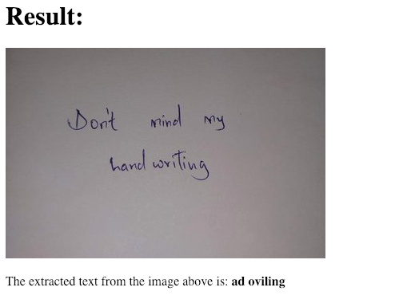
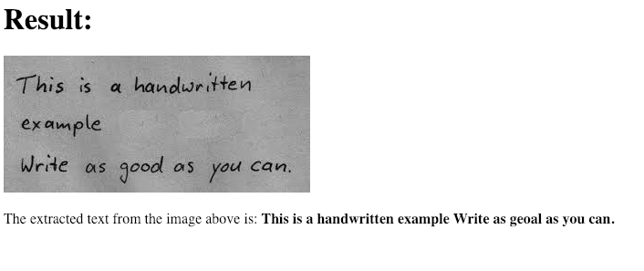

### A Python Approach to Character Recognition

#### Introduction
In this post, we will delve into the depth of Optical Character recognition and its application areas. We will also build a simple script that will help us detect characters from images and expose this through a Flask application for a more convenient interaction medium.

#### What is Optical Character Recognition?
Optical Character Recognition involves the detection of text content on images and translation of the images to encoded text that the computer can easily understand. An image containing text is scanned and analyzed in order to identify the characters in it. Upon identification, the character is converted to machine-encoded text.

How is it really achieved? To us, text on an image is easily discernible and we are able to detect characters and read the text, but to a computer, it is all a series of dots. This is where optical character recognition comes in.

The image is first scanned and the text and graphics elements are converted into a bitmap, which is essentially a matrix of black and white dots. The image is then pre-processed where the brightness and contrast are adjusted to enhance the accuracy of the process. 

The image is now split into zones identifying the areas of interest such as where the images or text are and this helps kickoff the extraction process. The areas containing text can now be broken down further into lines and words and characters and now the software is able to match the characters through comparison and various detection algorithms. The final result is the text in the image that we require. 

The process may not be 100% accurate and might need human intervention to correct some elements that were not scanned correctly. Error correction can also be achieved using a dictionary or even Natural Language Processing (NLP).

The output can now be converted to other mediums such as word documents, PDFs or even audio content through text-to-speech technologies.

#### Uses of OCR
Previously, digitization of documents was achieved by manually typing the text on the computer. Through OCR, this process is made easier as the document can be scanned, processed and the text extracted and stored in an editable form such as a word document. 
If you have a document scanner on your phone, such as Adobe Scan, you have probably encountered OCR technology in use. 
Airports can also use OCR to automate the process of passport recognition and extraction of information from them.
Other uses of OCR include automation of data entry processes, detection, and recognition of car number plates.

#### What we’ll use
For this OCR project, we will use the <a rel="nofollow" target="_blank" href="https://pypi.org/project/pytesseract/"> Python-Tesseract </a> or simply PyTesseract library which is a wrapper for <a rel="nofollow" target="_blank" href="https://github.com/tesseract-ocr/tesseract"> Google’s Tesseract-OCR Engine </a>. I went for it because it is completely open-source and being developed and maintained by the giant that is Google. Follow these <a rel="nofollow" target="_blank" href="https://github.com/tesseract-ocr/tesseract/wiki#installation"> instructions </a>  to install Tesseract on your machine since PyTesseract depends on it.
We will also use <a rel="nofollow" target="_blank" href="http://flask.pocoo.org/"> Flask framework </a> to create our simple OCR server where we can take pictures via the webcam or upload photos for character recognition purposes.
We are also going to use <a rel="nofollow" target="_blank" href="https://pipenv.readthedocs.io/en/latest/"> Pipenv </a> since it also handles the virtual-environment setup and requirements management.
We’ll also use the <a rel="nofollow" target="_blank" href="https://github.com/python-pillow/Pillow">Pillow </a> library which is a fork of the Python Imaging Library (PIL) to handle the opening and manipulation of images in many formats in Python.
We will also use Python3 for this project.

In this post, we’ll concentrate on Pytesseract although there are other Python libraries that can help you extract text from images such as:
- <a rel="nofollow" target="_blank" href="https://textract.readthedocs.io/en/stable/"> Textract </a> which can extract data from PDFs but is a heavy package.
- <a rel="nofollow" target="_blank" href="https://gitlab.gnome.org/World/OpenPaperwork/pyocr"> Pyocr </a> offers more detection options such as sentences, digits or words.

#### Setup

Start by installing Pipenv using the following command via Pip (In case you need to set it up, refer to <a rel="nofollow" target="_blank" href="https://pip.pypa.io/en/stable/installing/"> this </a>).
```
$ pip install pipenv
```

Create the project directory and initiate the project by running the following command.
```
$ mkdir ocr_server && cd ocr_server && pipenv install --three
```

We can now activate our virtual environment and start installing our dependencies as follows:
```
$ pipenv shell
$ pipenv install pytesseract Pillow 
```

In case you’ll not be using Pipenv, you can always use the <a rel="nofollow" target="_blank" href="https://pip.pypa.io/en/stable/installing/"> Pip </a> and <a rel="nofollow" target="_blank" href="https://docs.python.org/3/tutorial/venv.html"> Virtual Environment </a> approach. I have attached useful resources to help you get started with Pip and Virtual environments. 
> In that case, instead of `pipenv install Pillow`, the command will be `pip install Pillow`. 

#### Implementation
We are going to implement this project in 2 phases. In the first, we’ll create the script and in the next, we’ll build a Flask application to act as an interface.

##### Phase 1: OCR Script
With our first requirement out of the way, we will now create a simple function that takes an image and returns the text detected in the image. This will be the core of our project. Create a file called ocr_core.py and add the following code. I’ll comment and explain the code.

```
try:
   from PIL import Image
except ImportError:
   import Image
import pytesseract

def ocr_core(filename):
   """
   This function will handle the core OCR processing of images.
   """
   text = pytesseract.image_to_string(Image.open(filename))  # We'll use Pillow's Image class to open the image and pytesseract to detect the string in the image
   return text

print(ocr_core(‘images/ocr_example_1.png’)
```

The function is quite straightforward, in the first 5 lines we import Image from the Pillow library and our Pytesseract library.

We then create and `ocr_core` function that takes in a file name and will return the text contained in the image.

I took a screenshot of the title of the blog post and used it as my first sample image dubbed `ocr_example_1.png`. I also created a new folder called images that will host all the images that we will perform OCR operations on. 

This is the image:


And this is the output of executing out script:


Our simple OCR script works!! There’s quite more that we can do with the PyTesseract library, but more on this later in this post.

We will now integrate this script into a Flask application to make it easier for users to perform character recognition operations.

##### Phase 2: Flask Web Interface
Our script can be used via the command line but a Flask application would make it more user-friendly and versatile. For instance, we can upload photos via the website and get the extracted text displayed on the website or we can capture photos via the web camera and perform character recognition on them.
If you are unfamiliar with the Flask framework, this is a <a rel="nofollow" target="_blank" href="https://www.tutorialspoint.com/flask/index.htm"> good tutorial </a> to get you up to speed and going.

Let’s start by installing the Flask package:
```
$ pipenv install Flask
```

Create an `app.py` file with the following contents:
```
from flask import Flask
app = Flask(__name__)

@app.route('/')
def home_page():
   return "Hello World!"

if __name__ == '__main__':
   app.run()
```

Save the file and run using:
```
$ python3 app.py
```

If you open your browser and head on to `127.0.0.1:5000` or `localhost:5000` you should see "**Hello World!**" on the page. This means our Flask app is ready for the next steps.

We’ll now create a templates folder to host our HTML files. Create a simple index.html file with the following content:
```
<!DOCTYPE html>
<html>
 <head>
   <title>Index</title>
 </head>
 <body>
   Hello World.
 </body>
</html>
```

Let us also tweak our `app.py` to render our new template:
```
from flask import Flask, render_template
app = Flask(__name__)

@app.route('/')
def home_page():
   return render_template('index.html')

if __name__ == '__main__':
   app.run()
```

Notice we have now imported `render_template` and used it to render the HTML file. If you restart your Flask app, you should still see “**Hello World!**” on the home page.

That’s enough on the Flask crash course, let us now integrate our OCR script on the web application. First, we’ll add functionality to upload images on our Flask app and pass them to the ocr_core function that we wrote above. We will then render the image beside the extracted text on our web app as a result. 

Our final app.py:
```
import os
from flask import Flask, render_template, request

# import our OCR function
from ocr_core import ocr_core

# define a folder to store and later server the images
UPLOAD_FOLDER = '/static/uploads/'

# allow files of a specific type
ALLOWED_EXTENSIONS = set(['txt', 'pdf', 'png', 'jpg', 'jpeg'])

app = Flask(__name__)

# function to check the file extension
def allowed_file(filename):
   return '.' in filename and \
          filename.rsplit('.', 1)[1].lower() in ALLOWED_EXTENSIONS


# route and function to handle the home page
@app.route('/')
def home_page():
   return render_template('index.html')

# route and function to handle the upload page
@app.route('/upload', methods=['GET', 'POST'])
def upload_page():
   if request.method == 'POST':
       # check if there is a file in the request
       if 'file' not in request.files:
           return render_template('upload.html', msg='No file selected')
       file = request.files['file']
       # if no file is selected
       if file.filename == '':
           return render_template('upload.html', msg='No file selected')

       if file and allowed_file(file.filename):

           # call the OCR function on it
           extracted_text = ocr_core(file)

           # extract the text and display it
           return render_template('upload.html',
                                  msg='Successfully processed',
                                  extracted_text=extracted_text,
                                  img_src=UPLOAD_FOLDER + file.filename)
   elif request.method == 'GET':
       return render_template('upload.html')

if __name__ == '__main__':
   app.run()
```

As we can see in our `upload_image()` function, we will receive the image via POST and render the upload HTML if the request is GET. We check whether the user has really uploaded a file and use the function `allowed_file()` to check if the file is of an acceptable type.

Upon verifying that the image is of the required type, we then pass it to the character recognition file we created earlier in the post. The function detects the text in the image and returns it. Finally, as a response to the image upload, we render the detected text alongside the image for the user to see the results.

The `upload.html` file will handle the posting of the image and rendering of the result by the help of the  <a rel="nofollow" target="_blank" href="http://jinja.pocoo.org"> Jinja templating engine </a> which ships with Flask by default. Our upload.html looks like this:
```
<!DOCTYPE html>
<html>
 <head>
   <title>Upload Image</title>
 </head>
 <body>

   
   <h1>{{ msg }}</h1>
   
  
   <h1>Upload new File</h1>
  
   <form method=post enctype=multipart/form-data>
     <p><input type=file name=file>
        <input type=submit value=Upload>
   </form>

   <h1>Result:</h1>
   
     
   
  
   
     <p> The extracted text from the image above is: <b> {{ extracted_text }} </b></p>
  
   
     The extracted text will be displayed here
   
 </body>
</html>
```

Jinja templating allows us to display text in specific scenarios through the ` ` tags. We can also pass messages from our Flask app to be displayed on the webpage within the `{{ }}` tags. We use a form to upload the image to our Flask app.

The result is:



Now, if we go ahead and upload our image from earlier:



Yes! Our Flask application has been able to integrate the OCR functionality and display the text on the browser. This makes it easier to process images instead of running commands on the CLI every time we have a new image to process.

I will attach some more images to further explore the limits of our simple OCR script since it will not work in all situations. For example, I tried extracting text from the following image and the result has been highlighted on the image:


This is evidence that OCR is not always 100% accurate and may need human intervention from time to time.

I also tested the OCR script against my handwriting to see how it would perform, and this is the result:



As you can see, it cannot quite extract text from my handwriting as it did with other images we’ve seen before. I decided to give it another try, this time with an image from <a rel="nofollow" target="_blank" href="https://www.researchgate.net/publication/224759117_Multimedia_Information_and_Mobile-Learning"> this source </a>, and these were the results:



The character recognition on this image is much better than the one where I used my own handwriting. As you can see the lines in the downloaded image are thicker and this could be the reason for the poor detection on my handwriting. This is an area to explore further, you can get handwritten notes from friends or colleagues and see how well the script will be able to detect characters. You can even get posters to events and try scanning them for text, the possibilities are plenty.

`Python-Tesseract` has more options you can explore. For example, you can specify the language by using a `lang` flag, i.e. 
```
pytesseract.image_to_string(Image.open(filename), lang=’fra’)
```

You can also extract bounding box estimates or get verbose data including boxes, confidences, line and page numbers.

#### What we haven’t done 
We have accomplished a lot in this post, but there is still more to do to refine our project and prepare it for the real world. First, we can add style our website and make more appealing to the end user by using CSS. We can also add the option to upload and scan multiple images at once and displaying all their output at once. Wouldn’t this make it more convenient to scan multiple documents?

The browser allows us to tap into a machine’s camera and capture images. This can be of great help especially on mobile devices. Instead of the user having to capture and save the image then uploading it on the website, if we add the camera functionality, we can allow the user to perform the operations directly from the Flask web application. This will make the scanning process faster.

Suppose a Flask application is not what you intended to expose your OCR scanner, you can also create a CLI tool. The tool would allow you to run a command including the location of the image and then printing the output of the scanner to your terminal or sending it to a database or API. If you chose this path <a rel="nofollow" target="_blank" href="https://github.com/docopt/docopt"> Docopt </a> is a fantastic tool for building command line tools using Python.

#### Conclusion
Through Tesseract and the Python-Tesseract library, we have been able to scan images and extract text from them. This is Optical Character Recognition and it can be of great use in many situations. We have built a scanner that takes an image and returns the text contained in the image and integrated it into a Flask application as the interface. This allows us to expose the functionality in a more familiar medium and in a way that can serve multiple people simultaneously. 

The source code for this project is available <a rel="nofollow" target="_blank" href="https://github.com/ro6ley/python-ocr-example"> here on Github </a>.
